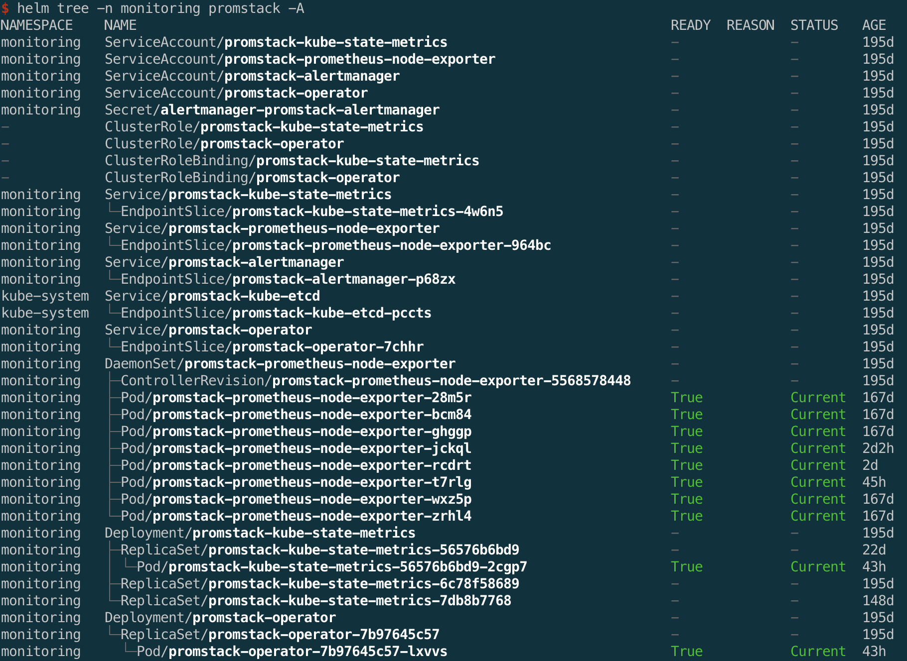

# helm-tree

A helm plugin to show the manifests resource tree of a release.

This plugin was inspired by [kubectl-tree](https://github.com/ahmetb/kubectl-tree) which is an outstanding kubectl plugin.

As a helm user, I often need to take a glance at all the resources related to a helm release.  Of course helm provides us `helm get values` and `helm get manifest` which helps us to get all the things a helm release creates in a quick way while it loses some details like subresources created by a parent resource and the status of each of them.

Then `helm-tree` was built for it.



## Usage

```bash
helm tree -n your-namespace release-name
```

## Install

```bash
helm plugin install https://github.com/major1201/helm-tree
```

## Flags

By default, the plugin will only search "namespaced" objects in the same namespace as the specified object.

You can use the -A or --all-namespaces flag to search namespaced and non-namespaced objects in all namespaces.

## License

Apache 2.0. See [LICENSE](./LICENSE).
